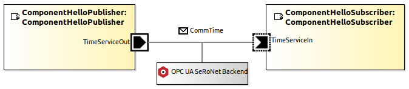
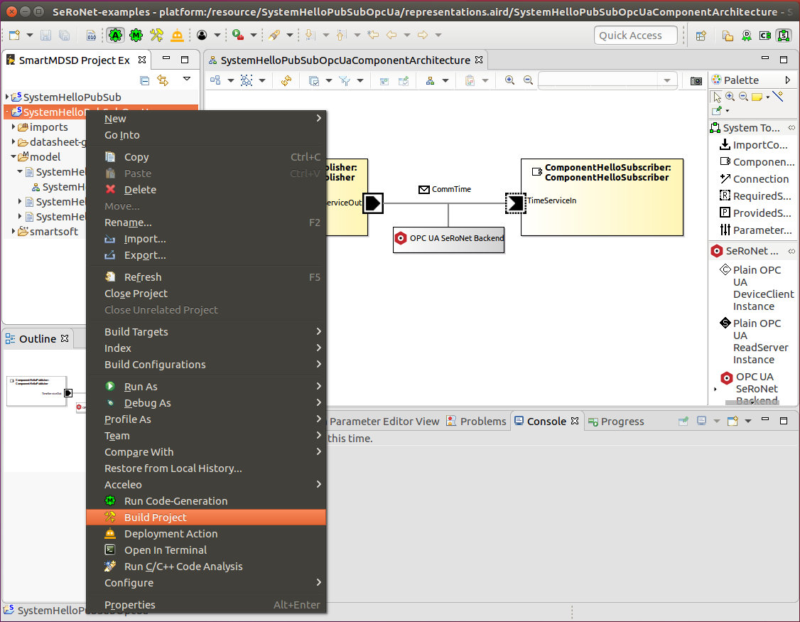
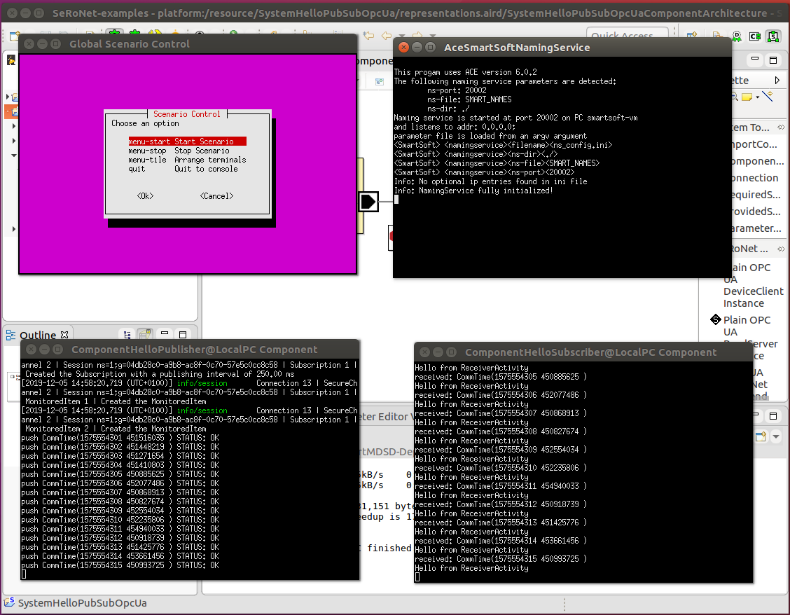

# SeRoNet Tooling Collection - OPC UA Backend Example

This example demonstrates a powerful feature to transparently exchange the internal middleware technology in a system model without touching the source-code of the involved components. The example system located in this folder configures its two components to communicate using the SeRoNet OPC UA Backend as the underlying middleware technology:

The example system uses the same components provided in the previous **[Hello-World Example](../SeRoNet-Tooling-Hello-World/)**. More precisely, to try out this example, you also have to import the following projects into your workspace in addition to the here located example system:

* **DomainHelloServices**
* **ComponentHelloPublisher**
* **ComponentHelloSubscriber**

To import the projects into your system, use the Eclipse menu: **File** => **Import** => **General** => **Existing Projects into Workspace** and click the **Next** button. In the following window, click the **Browse...** button and select your local folder where you cloned the examples repository. Complete the import by clicking the **Finish** button.

We also highly recommend reading the related **[Readme.md](../SeRoNet-Tooling-Hello-World/Readme.md)** before you continue so you know how to operate the basic menus of the SeRoNet Tooling.

The next section will demonstrate the few additional steps required to exchange the default middleware by the SeRoNet OPC UA Backend middleware realization (to achieve the configuration shown in the above image).

## Update Component Configurations and refine the System Model

The SeRoNet Tooling Collection version 1.1 currently supports two main middleware realizations, the **[ACE/SmartSoft Backend](https://github.com/Servicerobotics-Ulm/AceSmartSoftFramework)** and the **[SeRoNet OPC UA Backend](https://github.com/seronet-project/SeRoNet-OPC-UA-Backend)**. The former is a very robust and time-tested middleware realization based on message passing. The latter is a more recent realization developed within the [SeRoNet Project](https://www.seronet-projekt.de/). If you don't select a specific middleware realization in the models, then the former middleware is automatically used by default. However, replacing the used middleware is very easy as is demonstrated in this section hereafter.

First, we need to select two parameters in the component model. Therefore, open the component model diagram of the **ComponentHelloPublisher** as shown in the next screenshot:

Now select the **TimeServiceOut** output port in the component diagram and open the **Properties** tab at the bottom of the Eclipse window (as shown in the screenshot above). In the Properties tab, scroll down until you see the group named **Supported Middlewares** and select the two middlewares: **SeRoNet OPC UA Backend** and the **ACE/SmartSoft Backend**. Save the model (e.g. by using the Eclipse menu **File** => **Save**).

Now open the other component named **ComponentHelloSubscriber** and repeat the same steps for the **TimeServiceIn** input port as shown in the next screenshot: 

This configuration tells the system models that these components now can be flexibly configured to use one of the predefined middlewares. Again, if the system does not select any middleware specifically, then the ACE/SmartSoft backend is used automatically by default. In order to change the used middleware, open the **SystemHelloPubSub** (or the preconfigured system **SystemHelloPubSubOpcUa**), and open the **SystemComponentArchitecture** diagram as shown in the next screenshot:

You can also create the system by yourself as described in the related **[Readme.md](../SeRoNet-Tooling-Hello-World/Readme.md)**. Now, at the top of the central Eclipse window you will see the diagram tools. Here you will find the **Layers** tool  with an arrow pointing downwards to open a context menu. If you click on this arrow, you will see the context menu as shown in the above screenshot, where you can activate the **SeRoNet Layer**. Many of the diagrams support different layers, and some of the layers are optional and not activated by default. After activating the SeRoNet layer, you might notice the newly appeared **SeRoNet Tools**  in the tool palette at the right side of the diagram window. Here you can select the **SeRoNet OPC UA Backend** tool and drag-and-drop it into the diagram window. A popup window will ask you to select a specific connection between component ports that will be configured to now use the OPC UA Backend for communication. Again, don't forget to save the model to reflect the changes in the generated code.

Please notice, the backend selection can be specified for each connection explicitly, so if we have multiple components with multiple connections, we can specify a differently used middleware for each connection separately. In this way, we can select even for the same component different middlewares for the different ports of that component. Please note that the actual code of the components remains unchanged, and the middleware selection is done solely at model configuration level.

## Deploying and launching the SystemHelloPubSubOpcUa

For launching the SeRoNet OPC UA Backend example we assume that you either have updated the system as described above, or that you have cloned the preconfigured system **SystemHelloPubSubOpcUa** from this git repository and imported it into your Eclipse workspace as described at the beginning of this page.

As a precondition for being able to build components that use the **SeRoNet OPC UA Backend**, you also have to install the related library. The SeRoNet OPC UA Backend library is publicly available as open-source here:

[https://github.com/seronet-project/SeRoNet-OPC-UA-Backend](https://github.com/seronet-project/SeRoNet-OPC-UA-Backend)

Please follow the installation instructions provided in the above link.

Now, you can easily build all the related components of the system by right clicking at the **SystemHelloPubSubOpcUa** project within the **SmartMDSD Project Explorer** and selecting the menu action **Build Project** as shown in the next screenshot:

After the actual deployment (i.e. the uploading of all related binaries, libraries and configurations files to the target platform) has finished, a dialog window will appear asking whether one wants to remotely launch the deployed system:

If you accept the dialog by pressing **Yes** a new terminal window will open that internally creates an SSH connection to the target and starts a simple terminal menu as shown at the upper left in the next screenshot:

You can now launch all the components of the system by selecting the menu option **Start Scenario** and pressing **enter**. This will open three new terminal windows, one for the naming service and one for each of the two components. You can stop the system by selecting the related menu option **Stop Scenario** and pressing **enter**.

Congratulations! You now have learned how to exchange the underlying middleware for components used in a system model. Please notice, the middleware exchnage is only one of the many features of the tooling, and there is a lot more to discover. Please consider checking out our other [Online Tutorials](https://wiki.servicerobotik-ulm.de/tutorials:start) focusing on specific robotics use-cases.