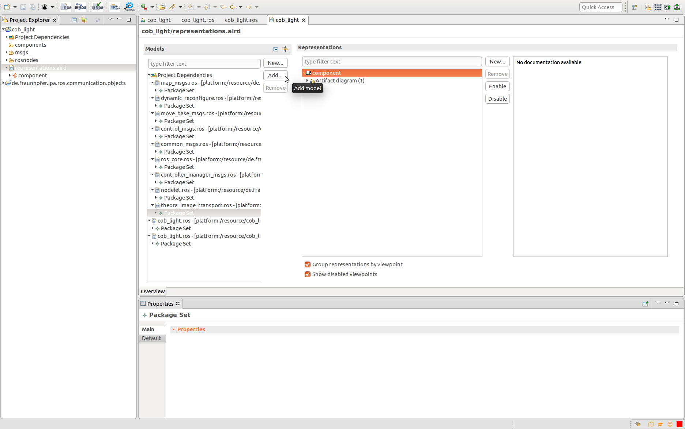
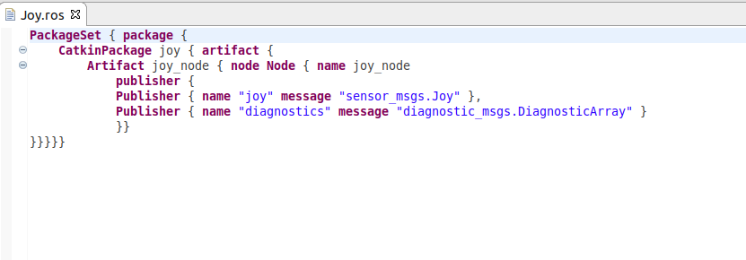

# SeRoNet Tooling Collection - ROS support

The [Robot Operanting System (ROS)](https://www.ros.org/) is a flexible framework for writing robot software. It is a collection of tools, libraries, and conventions that aim to simplify the task of creating complex and robust robot behavior across a wide variety of robotic platforms.

ROS offers components (called packages) that cover most robotics sub-domains, there are already over 3000 packages available. The ROS code, mostly hand written, lack habitually a proper formal description of its architecture, in other words models. The ROS tooling, part of the SeRoNet tooling collection, aims to compensate this shortcoming providing a formal language that allows to the user the description of ROS basic concepts. Thanks to this language we can very easily connect ROS existing code with SeRoNet structures.

### Step 1: use the ROS developer perspective to describe ROS nodes

To switch to the ROS Tooling perspective within the SeRoNet tooling, you have to go the menu **Window**=>**Perspective**=>**Open Perspective** and choose **ROS developer**.

As ROS does the first objects to be defined are the types of messages, services and actions. To make easier the setup of the workspace, a button clones from Git and import automatically the most common ROS types (this function works only with Internet connection):

 

A new project will be automatically loaded to your project explorer including a set of ROS package descriptions:

 

In case, likely, that the ROS software to be described use other type of object specifications, we facilitate a couple of tools to auto generate the corresponding model (these tools work only for messages and services, the action types have to be unfortunately implemented manually):

- Use our cloud facilities : [ROS Model Extractor](http://ros-model.seronet-project.de/) and navigate to the tag "Specification Analysis". There, if the package that contains the message types is released for Melodic you just have to give the name of the package and press **Submit**. Otherwise please specify first the name of the Git repository that hold the package

- Use locally the helper script:

    ```
    source /your_ROS_workspace
    wget https://raw.githubusercontent.com/ipa320/ros-model-cloud/master/extractor-interface/scripts/generate_messages_model_helper.sh
    chmod +x generate_messages_model_helper.sh
    ./generate_messages_model_helper.sh ROS_PACKAGE_NAME > ROS_PACKAGE_NAME.ros
    ```

The file generated, independently of the method, will have a *.ros* extension and can be copied to the folder "basic_msgs" of the "de.fraunhofer.ipa.ros.communication.objects" project, please send us a pull request to our [repository](https://github.com/ipa320/RosCommonObjects.git) with your models to include them to the base dictionary automatically. Alternatively, for cases where the messages types are specific for a concrete component (like the ur_msgs for ur_driver or messages types defined whitin the same reposotory that the node) we recommended to follow the same approach than ROS does, define the communication objects models together with the node description, for our tooling that means copy the file to the project that will be created on the next step for your node description.

Having generated the msgs package dependencies the next step is to describe your component (i.e. ROS node). First, we have to create a new ROS project, using one of the buttons of the toolbar:


A pop-up dialog will ask you to define the name of the project. Once  you press finish a new folder will be created with a dependency to the common ROS communication objects project and a predefined ROS model. To describe easily the model you can use a Sirius representation, this view should be automatically generated and open by default, if not you can explore the project and open the *representation.aird* file using the [aird editor](https://www.eclipse.org/sirius/doc/user/general/Aird_Editor.html), please check that all the required dependencies models are imported. In case you defined previously a new *.ros* model for your communication models, we recommend to create a new folder within this new project (*msgs* for example) and copy there the model file. Then open the representation file (right click on the *representation.aird* file and choose *"Open with.."* and *"Aird Editor"*), under the column *Models* press the button *Add..* and select your model file:



To go back to the component representation view, explore the components menu under *Representations* and open your artifact diagram with a double click. In case it is empty use the side buttons *New..* and/or *Enable* to get the proper graphical editor configuration.

 A new window will be opened where you can choose and add elements by selecting them on the side toolbar. Using the properties view you can modify and describe the properties of each element. For the reference of ROS object types (like a *Message* for a *Topic*), please use the icon  and use its help dialog to set the reference correctly.


Alternatively, we made available [a web interface](http://ros-model.seronet-project.de/) that based on [HAROS](https://github.com/git-afsantos/haros) can extract automatically the ROS model from the C++ or Python code from your GitHub repository (only working for Melodic) . This method doesn't support cases where the node interfaces are dynamically configured through parameters.

Once you finish you can open the file under the folder "rosnodes" that  describes your model and check that all the information is correct. This editor has an autocomplete function (by pressing Ctrl+Space) and will  report any error made by editing. For example:



Please check the [ROS tooling documentation and tutorials](https://github.com/ipa320/ros-model#tutorials) to get further information.


### Step 2: Connect the ROS Model to SeRoNet components

#### 2.1 Transform Communication objects

Like in ROS to describe a communication port we have first to define the type of the information to be exchanged (i.e. msgs, srvs and actions), in SeRoNet, we have to start with the models of the communication objects.

For the common ROS objects, the respective SeRoNet objects are already translated and available within this [repository](https://github.com/ipa-nhg/SeRoNet-examples/tree/ROSdocu/SeRoNet-Tooling-ROS-Mixed-Port/DomainRosModelsRepositories).

For custom messages, we made available a function that transforms automatically a ROS model file that contains types to SeRoNet models,  for example this file part of the [cob_light project](https://github.com/ipa-nhg/ros-model-examples/tree/master/RosComponents/cob_light) :

```
PackageSet{package{
    Package cob_light{ spec { 
      TopicSpec ColorRGBAArray{ message { "std_msgs.ColorRGBA"[] colors }},
      TopicSpec LightMode{ message { uint8 mode float32 frequency float32 timeout int32 pulses int8 priority "std_msgs.ColorRGBA"[] colors "cob_light.Sequence"[] sequences }},
      TopicSpec Sequence{ message { "std_msgs.ColorRGBA" color float32 hold_time float32 cross_time }},
      TopicSpec SetLightModeAction{ message { SetLightModeActionGoal action_goal SetLightModeActionResult action_result SetLightModeActionFeedback action_feedback }},
      TopicSpec SetLightModeActionFeedback{ message { Header header "actionlib_msgs.GoalStatus" status SetLightModeFeedback feedback }},
      TopicSpec SetLightModeActionGoal{ message { Header header "actionlib_msgs.GoalID" goal_id SetLightModeGoal goal }},
      TopicSpec SetLightModeActionResult{ message { Header header "actionlib_msgs.GoalStatus" status SetLightModeResult result }},
      TopicSpec SetLightModeFeedback{ message { uint8 active_mode uint8 active_priority }},
      TopicSpec SetLightModeGoal{ message { "cob_light.LightMode" mode }},
      TopicSpec SetLightModeResult{ message { uint8 active_mode uint8 active_priority uint64 track_id }},
      ServiceSpec SetLightMode{ request { "cob_light.LightMode" mode } response { uint8 active_mode uint8 active_priority uint64 track_id } },
      TopicSpec LightModes{ message { uint8 NONE uint8 STATIC uint8 FLASH uint8 BREATH uint8 BREATH_COLOR uint8 FADE_COLOR uint8 SEQ uint8 CIRCLE_COLORS uint8 SWEEP uint8 DIST_APPROX uint8 GLOW uint8 XMAS }},
      ServiceSpec StopLightMode{ request { uint64 track_id } response { uint8 active_mode uint8 active_priority uint64 track_id } }
    }}
  }
}
```

The user can very easily trigger this function by a  right clicking on the ROS model file (cob_light/msgs/cob_light.ros) and  selecting the option "Generate SeRoNet communication objects".

This will generate the file services and the file types under the folder *src-gen*.


For further information please see: [SeRoNet Tooling ROS Mixed Port documentation](https://github.com/ipa-nhg/SeRoNet-Tooling-ROS-Mixed-Port/tree/M2MCommunicationObjectsReadme/de.seronet_projekt.ros.componentGateway.generator#automatic-transformation-of-communication-objects)

These files are the input for a SeRoNet Domain Model. By creating a [new Domain Project](https://wiki.servicerobotik-ulm.de/tutorials:develop-your-first-domain-model:start) you can just copy these two files and the models will be automatically added to the interpreter.


Probably after create the new Domain Models project and add the types and services files you will get an error because of missed dependencies.

For the most common ROS objects the project dependencies are already available. We suggest to import **always** by default the following projects from the following GitHub repositories:

- [DomainModelsRepositories/CommBasicObjects](https://github.com/Servicerobotics-Ulm/DomainModelsRepositories)
- [SeRoNet-examples/SeRoNet-Tooling-ROS-Mixed-Port/DomainRosModelsRepositories/ROSRos_core](DomainRosModelsRepositories/ROSRos_core)
- [SeRoNet-examples/SeRoNet-Tooling-ROS-Mixed-Port/DomainRosModelsRepositories/ROSCommon_msgs](DomainRosModelsRepositories/ROSCommon_msgs)

Then open the Domain Expert perspective (Go to Menu Window ->  Perspective -> Open Perspective -> Other... -> Domain Expert)  and for the created Domain Models expert that holds your communication  object add the import dependencies (Right click on *imports* folder).


#### 2.2 Connect ROS interfaces to SeRoNet Ports

By default the tooling will automatically autogenerate the corresponding component interface (a generic model of a component) of all the nodes  on your ROS project. The autogenerated components are always located  under a new folder called *components/*. This model is the bridge from ROS to other frameworks. For the case of SeRoNet the tooling  includes a special function that can be activated by a right click on  the file an choosing the option *Generate ROS-SeRoNet Mixed Port*.

The result of this call is a *rospoolinterface* file, which can be interpreted by a [SeRoNet component](https://wiki.servicerobotik-ulm.de/tutorials:develop-your-first-component:start) to describe one if its ports.


Complementarity and to make easier the relay of interfaces we  incorporated an extra help function that automatically relays ROS interfaces from an existing model. The previous function through its pop-up dialog guides  the user to generates not only the rospoolinterface model but also a  suggestion of a SeRoNet component with a ROS mixed Port. The resulted  files will be generated under the folder *src-gen/SeRoNetComponent*

**

These two files can be used to create a [new SeRoNet component](https://wiki.servicerobotik-ulm.de/tutorials:develop-your-first-component:start). First the perspective have to be changed to the "Component Supplier"  one. This perspective will add the option to create a new Component  Project by giving a name and a localization. The previously generated  SeRoNetComponent files can simply be copied to the model folder of the  new project.

For this example the corresponding SeRoNet component with a ROS Mixed Port (by creating a [new SeRoNet component](https://wiki.servicerobotik-ulm.de/tutorials:develop-your-first-component:start) and including the autogenerated files) will shows:


To help the user to implement the logic of the resulted SeRoNet component, we made available several examples for different types of ROS Ports:

- Ros Publisher to be subscribed by a SeRoNet component: [ROSPublisher_examples](ROS-MixedPort-Examples/ROSPublisher_examples)
- Ros Subscriber to be published by a SeRoNet component: [ROSSubscriber_examples](ROS-MixedPort-Examples/ROSSubscriber_examples)
- Ros Service server to be called by  a SeRoNet component: [ROSServiceCall_examples](ROS-MixedPort-Examples/ROSServiceCall_examples)
- Ros Service client to  called  a SeRoNet component: [ROSClientCall_examples](ROS-MixedPort-Examples/ROSClientCall_examples)
