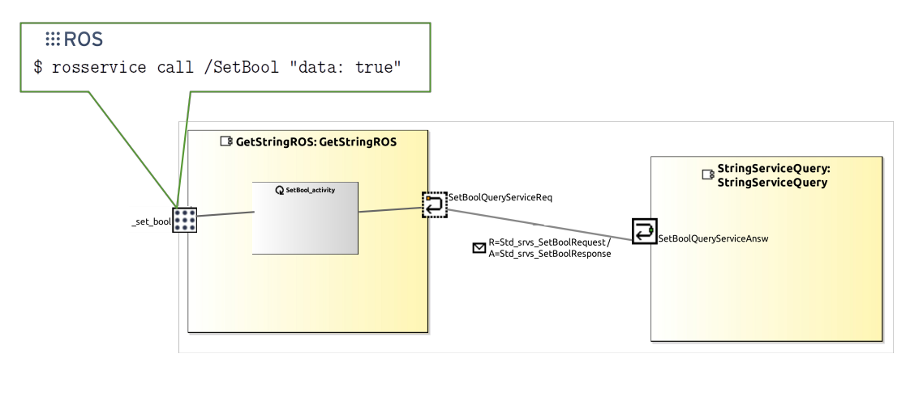
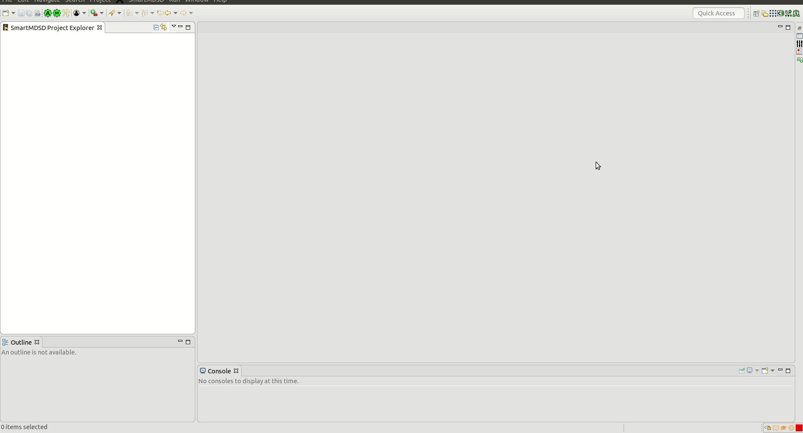
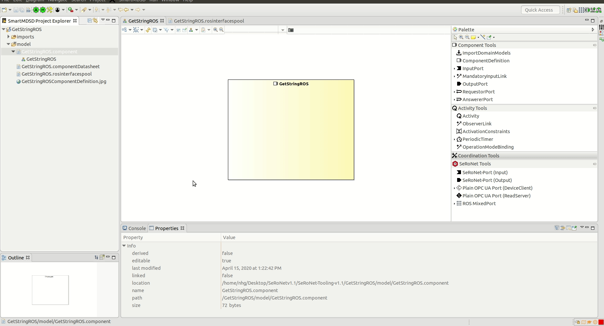
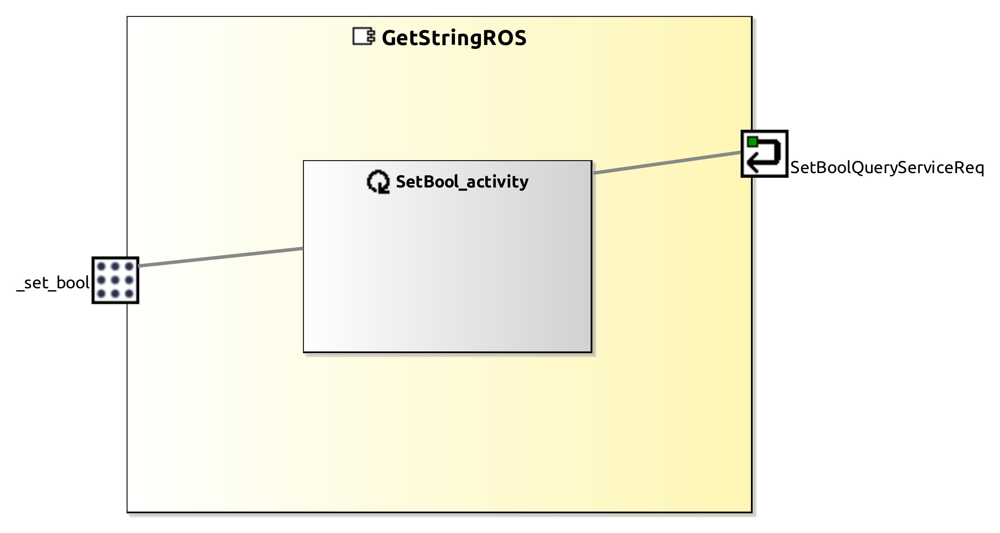
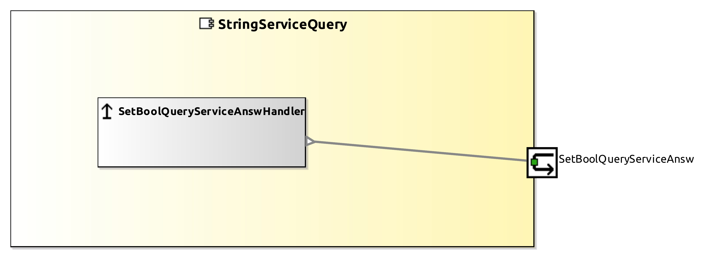
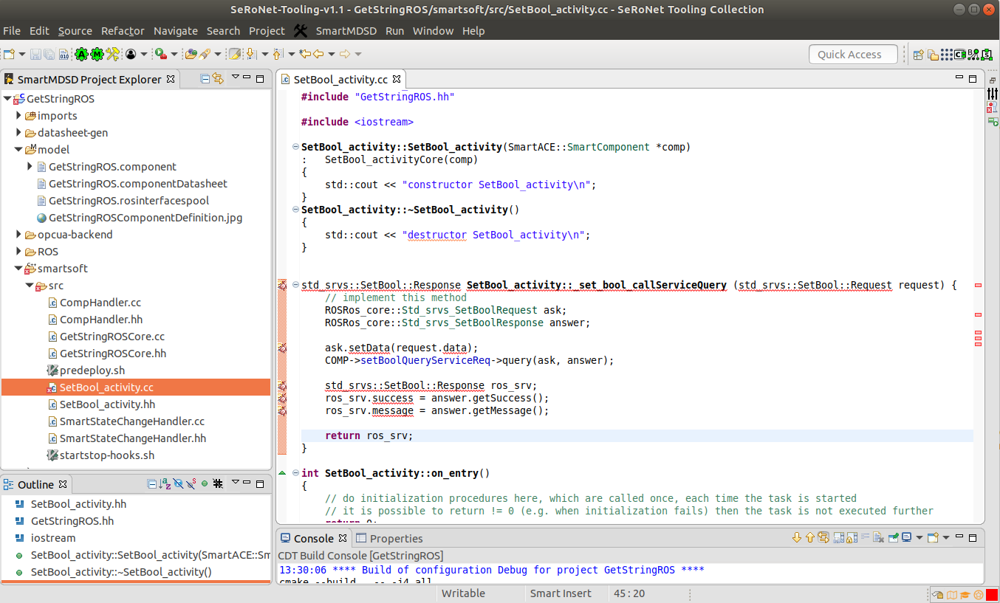
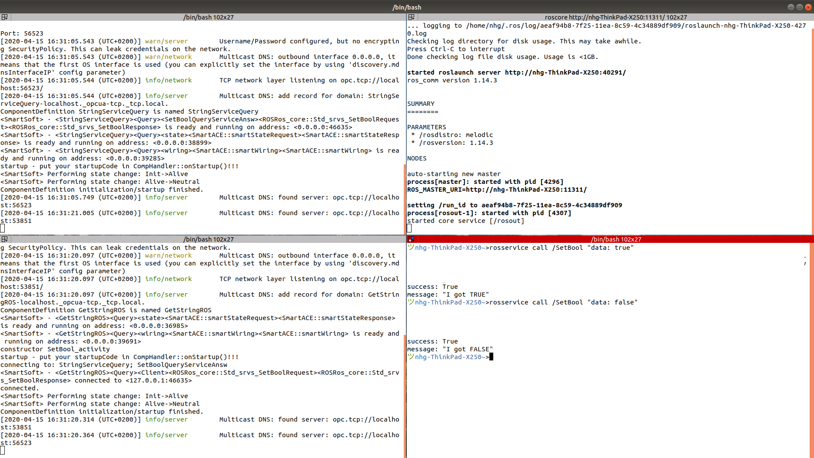

# ROS Service Client relay to SeRoNet network

This tutorial shows how to use the [SeRoNet Mixed port features](https://github.com/seronet-project/SeRoNet-Tooling-ROS-Mixed-Port) to connect a **ROS node model** from the [SeRoNet ROS tooling collection](https://github.com/ipa320/ros-model/) to the SeRoNet network. For this case, we use a **ROS client server** as interface to be relayed and explain the resulted model, the C++ code that will be auto generated and point the code parts where the user can implement further functionalities.

Some of the concepts explained in [SeRoNet Tooling Collection - ROS support](../../README.md) are required to perform this tutorial. A previous default setup of the workspace is necessary to follow the instructions of the tutorial: [WORKSPACE SETUP](../ROSMixedPortTutorials_WSsetup.md).

### System overview



### Required packages

**Domain Models projects::**

- [CommBasicObjects](https://github.com/Servicerobotics-Ulm/DomainModelsRepositories/tree/master/CommBasicObjects)

- [ROSRos_core](../../DomainRosModelsRepositories/ROSRos_core)


**Component model projects:**

- [StringServiceQuery](StringServiceQuery)

- GetStringROS(it will be created in this tutorial)

### SeRoNet components

First, the perspective have to be changed to the *Component Supplier* one. This perspective will add the option to [create a new Component Project](https://wiki.servicerobotik-ulm.de/tutorials:develop-your-first-component:start). Using the help dialog menu you can give the following description to your new component project:

- Project name: **GetStringROS** 
- Model type: **ComponentDefinition** and **ComponentDatasheet**
- Dependencies: **ROSRos_core** and **CommBasicObjects**

Once the *Component Project* is created we can copy the [GetStringROS.rosinterfacespool](GetStringROS.rosinterfacespool) file available within this repository to the folder *GetStringROS/model*. This file describes the mirror port of a **rosservice call** command for ROS and serves as reference to describe the ROS Mixed Port:
```
RosInterfacesPool {
	RosSrvServer _set_bool { srvName "/SetBool" type "std_srvs.SetBool" }
}
```



Where the name of the ROS service is */SetBool*, the type [std_srvs/SetBool](http://docs.ros.org/melodic/api/std_srvs/html/srv/SetBool.html) and the reference Port for SeRoNet *_set_bool*. Now we can modify the component file *GetStringROS/model/GetStringROS.component* to relay the ROS Port. We can open the graphical editor for the components and add the following elements:

- New *RequestPort* using the CommunicationService ROSRos_core.SetBoolQueryService 
- New *ROS MixedPort* for the ROS Srv Server *_set_bool*
- New *Activity* with the name *SetBool_activity*
- New *RequestPortLink* from the *SetBool_activity* to the *SetBoolQueryServiceReq* port
- New *MixedPortROSLink* from the *SetBool_activity* to the *_set_bool* port



The next figure shows the resulted SeRoNet component: GetStringROS.component




Which correspond to the following description:

```
ComponentDefinition GetStringROS logo "/GetStringROS/model/logo.png"
{
RequestPort SetBoolQueryServiceReq implements ROSRos_core.SetBoolQueryService {
	}
	MixedPortROS _set_bool
	Activity SetBool_activity
	{
		RequestPortLink SetBoolQueryServiceReq
		MixedPortROSLink _set_bool
	}
}
```

The other SeRoNet component that we will use for this example is the [StringServiceQuery](StringServiceQuery) the [SeRoNet workspace setup](../ROSMixedPortTutorials_WSsetup.md) should install this component automatically under the path *$SMART_PACKAGE_PATH/SeRoNet-examples/SeRoNet-Tooling-ROS-Mixed-Port*, you can import it to your workspace  (**File** => **Import** => **General** => **Existing Projects into Workspace** and click the **Next** button. In the following window, click the **Browse...** button and select your local folder **~/SOFTWARE/smartsoft/repos/SeRoNet-examples/SeRoNet-Tooling-ROS-Mixed-Port/ROS-MixedPort-Examples/ROSClientCall_example/StringServiceQuery**) and build it on your system using the *Build Project* button .



### Code implementation

In this section, we will adapt the auto generated C++ code to transform the incoming ROS service call */SetBool* (std_srvs/SetBool) into a SeRoNet communication object that trigger a call to the *StringServiceQuery* Handler

In case the *AutoCodeGeneration*  button is disabled, you can select your project from the project Explorer  and press the *RunCodeGeneration*   , these two buttons are only available for the *Component Supplier* perspective.

The code generator will create 3 folders to hold the C++ code implementation of your component:

- ROS : this is the code related to the ROS Mixed Port. For this concrete case, it holds the implementation of the ROS Service server (*_set_bool* Port) to the */SetBool* service.
- smartsoft: this folder contains the code associated to the SeRoNet plain port and body of the component. For this example, it holds the implementation of the Request Port *SetBoolQueryServiceReq* and the activity  *SetBool_activity*
- opcua-backend: this is the code related to the OPC UA backend for the SeRoNet plain port. For this concrete example this code is not relevant.

For the ROS Mixed components the code generator is designed to completely implement the ports and prepare the Activity classes to be completed manually. This approach reduces considerably the integration effort for the user, who can concentrate on a particular area of the code to implement the logic of the component, consistently with the implementation of [SeRoNet plain components](../../../SeRoNet-Tooling-Hello-World/#creating-two-new-example-components).

That means that the user should be mostly interested on the code related  to the service handler, which can be found under *smartsoft/src*. There you we can find for this example the  source file (*smartsoft/src/SetBool_activity.cc*).

The source code of the *SetBool_activity* (*smartsoft/src/SetBool_activity.cc*) contains the method *set_bool_callServiceQuery* which getting as input the request message from the ROS service call  */SetBool* (type std_srvs/SetBool) tranform it to a SeRoNet request service (*Std_srvs_SetBoolRequest*) and query the message through the *SetBoolQueryServiceReq* port. The answer got from the *StringServiceQuery* component is transformed to a ROS service response (std_srvs/SetBool) and send back to the ROS middleware as answer from the service */SetBool* (implementation can be found in the source class GetStringROSRosPortExtension; code -> *ROS/src-gen/GetStringROSRosPortExtension.cc*):



--> [Solution code](GetStringROS) :wink:

### Execution

This section requires a proper installation of the SeRoNet backend and the correct setup  of the workspaces (see [SeRoNet workspace setup](../ROSMixedPortTutorials_WSsetup.md))

The first step, before we execute the code, is build the software. Unfortunately, the ROS build environment is not well supported by Eclipse which means that for the ROS Mixed Port examples the code have to be compiled using a terminal. 

```
source /opt/ros/*DISTRO*/setup.bash
cd *YourWSPath*/GetStringROSRos
cd smartsoft
mkdir build
cd build
cmake ..
make
```
The previous commands have to create a SeRoNet executable file for the GetStringROSRos under the folder *$SMART_ROOT_ACE/bin*, which execution will subscribe to the ROS service call */SetBool* and relay the command got to the SeRoNet *StringServiceQuery* component.

As usual, open a new terminal window and start the ROS master:

```
roscore
```

To configure the connection ACE at startup searches for an according configuration file for every component within a local folder named etc. For instance, for the *GetStringROSRos* component, an ini-file named *GetStringROSRos..ini* can be created within the folder *$SMART_ROOT_ACE/etc*:

```
mkdir $SMART_ROOT_ACE/etc
cp $SMART_PACKAGE_PATH/SeRoNet-examples/SeRoNet-Tooling-ROS-Mixed-Port/ROS-MixedPort-Examples/ROSClientCall_examples/*.ini $SMART_ROOT_ACE/etc/.
```

And lastly, in a two new terminal we have to start the *ACE Naming Service* daemon to allow the communication or the ACE side, the *StringServiceQuery* device and our created *GetStringROSRos* as follows:

```
cd $SMART_ROOT_ACE
./startSmartSoftNamingService
./bin/StringServiceQuery
./bin/GetStringROS
```
In a new terminal window execute the ROS service call command: 
```
rosservice call /SetBool "data: true"
```

