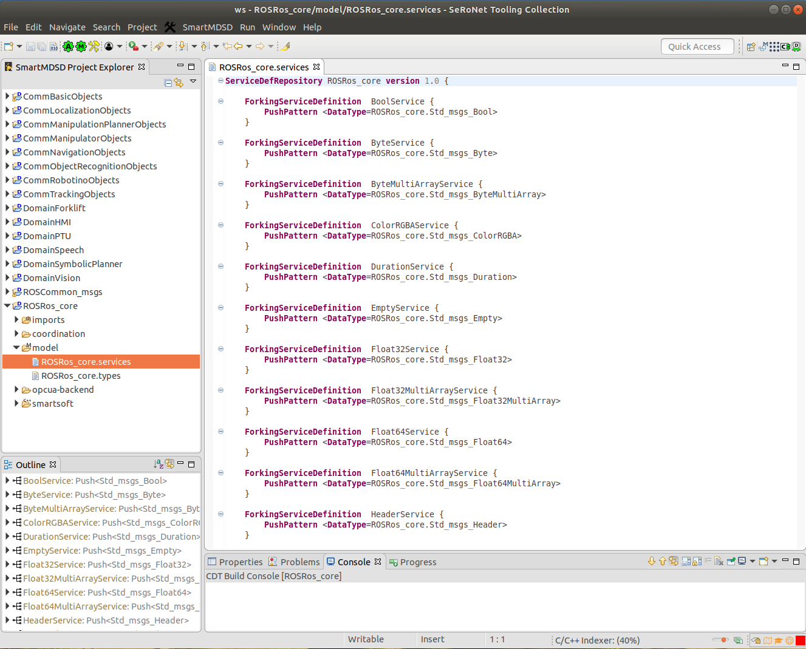
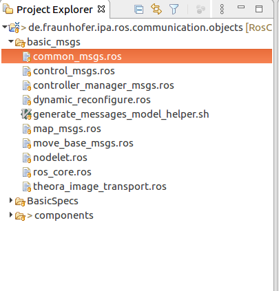

## WORKSPACE SETUP

This guide contains a set of recommendations about how to setup a default SeRoNet workspace to perform our tutorials.

### INSTALLATION

Primarily, remember the two methods we facilitate to install the SeRoNet tooling:

#### Use a pre-built Virtual Machine:

The virtual machine is available under the link: https://web2.servicerobotik-ulm.de/files/SeRoNet_Tooling/1.1/

#### Install the SeRoNet Toolchain locally:

- **Backend installation:**

```
wget https://github.com/Servicerobotics-Ulm/SeRoNet-Installer/raw/master/SeRoNet-Infrastructure-Installer-v1.0.sh
bash SeRoNet-Infrastructure-Installer-v1.0.sh
```

Once the installation script end, please verify that a workspace under the path *~/SOFTWARE* was created for your account and the variables *$SMART_PACKAGE_PATH*  and *$SMART_ROOT_ACE* are set and point to *~/SOFTWARE/smartsoft/repos* and *~/SOFTWARE/smartsoft* respectively.

- **SeRoNet tooling within an Eclipse environment:**

Download link: https://web2.servicerobotik-ulm.de/files/SeRoNet_Tooling/1.1/SeRoNet-Tooling-v1.1.tar.gz 
```
tar xzvf SeRoNet-Tooling-v1.1.tar.gz
SeRoNet-Tooling-v1.1/eclipse
```

#### Update the tooling features

SeRoNet is an ongoing project where we constantly update our tools to incorporate new features, then we recommend the check of the latest version of all our plug-ins before you start working on the Tooling.

Go to the upper toolbar of Eclipse and select the menu "Help" -> "Check for updates"

### SERONET WORKSPACE SETUP

To avoid compilation issues we strongly recommend the use of the default *$SMART_PACKAGE_PATH* path to clone existing repositories or to create new projects for models, especially for those projects that are required to compile further packages as dependencies, for example the Domain Expert projects.

**Get base projects**

Both installation methods will by default pre-install a set of common Domain and Components projects under the folder *~/SOFTWARE/smartsoft/repos*, just to up-to-date to the latest version we recommend firstly a pull of all the repositories:
```
cd $SMART_PACKAGE_PATH
ls | xargs -I{} git -C {} pull
```
To facilitate the execution of the tutorials and avoid duplicated instructions, during the setup the example repository can also be pulled to the default workspace:

```
cd $SMART_PACKAGE_PATH
git clone https://github.com/seronet-project/SeRoNet-examples
```
**Import common objects**

Now, that you have the latest version of all the needed projects, the next step is to import the Domain Objects Projects,  where all the interfaces to describe component ports and the interactions among these ports are described and that represent the basis of the component-based approaches.

Open **File** -> **Import** and select from the Selection Wizard the option **Existing Projects into Workspace**. The next dialog menu will allow to select the projects to be imported. Choose the option **Select root directory** and use the **Browse..** function to navigate to the folder *$SMART_PACKAGE_PATH/DomainModelsRepositories/* (likely it will be *~SOFTWARE/smartsoft/repos/DomainModelsRepositories*). The Wizard dialog by default will show a list of Projects and all of them selected, keep this configuration and press **Finish**. Repeat the same process to import the ROS-Mixed-Port Objects, by selecting as **root directory** the folder *~SOFTWARE/smartsoft/repos/SeRoNet-examples/SeRoNet-Tooling-ROS-Mixed-Port/DomainRosModelsRepositories*.

To show and filter all the imported packages you can switch to the *Domain Expert Perspective* using the Menu **Window** -> **Perspective** -> **Open Perspective** -> **Domain Expert**.



### ROS WORKSPACE SETUP

To switch to the ROS Tooling perspective within the SeRoNet tooling, you have to go the menu **Window**=>**Perspective**=>**Open Perspective** and choose **ROS developer**.

To make easier the setup of the workspace, a button clones from Git and import automatically the most common ROS types (this function works only with Internet connection):


A new project will be automatically loaded to your project explorer including a set of ROS package descriptions:

 

In case you want to do this step manually the repository with all the basic ROS objects is publicly available under: https://github.com/ipa320/RosCommonObjects