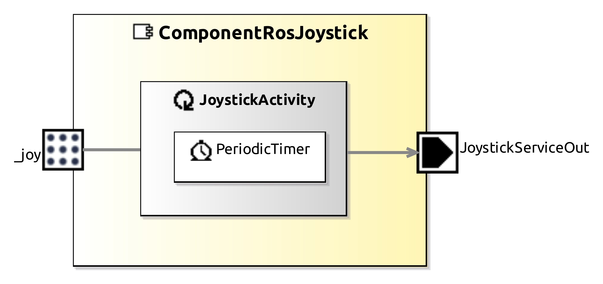

<!--- This file is generated from the ComponentRosJoystick.componentDocumentation model --->
<!--- do not modify this file manually as it will by automatically overwritten by the code generator, modify the model instead and re-generate this file --->

# ComponentRosJoystick Component



This example  shows a practical use case connecting a ROS native package to the SeRoNet world.

For this tutorial we chose one of the most common ROS project: **[joy_node](http://wiki.ros.org/joy)**, the project model is publicly available and ready to be used under:

```
git clone https://github.com/ipa-nhg/ros-model-examples
```

To get further information about how to create the model using the ROS developer tooling please visit the [ROS tooling documentation](https://github.com/ipa320/ros-model#tutorials).


To import the project into your system, use the Eclipse menu: **File** => **Import** => **General** => **Existing Projects into Workspace** and click the **Next** button. In the following window, click the **Browse...** button and select your local folder where you cloned the examples repository and choose the project **RosComponents/joy**. Complete the import by clicking the **Finish** button.

This package requires as dependency the common ROS interfaces, by clicking the button **Import Common ROS Objects** you will get the latest version from GitHub and import them automatically to your workspace, this function button is only available for the ROS developer perspective: menu **Window** => **Perspective** => **Open Perspective** => **ROS developer**.


If you navigate through the **joy** package and open the representation file you can get an overview o the model:


## Auto relay of ROS Mixed Ports

By default the tooling will automatically autogenerate the corresponding component interface (a generic model of a component) of all the nodes on your ROS project. The autogenerated components are always located under a new folder called *components/*. This model is the bridge from ROS to other frameworks. For the case of SeRoNet the tooling includes a special function that can be activated by a right-click on the file an choosing the option *Generate ROS-SeRoNet Mixed Port*.


The result of this call is a rospoolinterface file. The start point of the following tutorial: [Mixed-Port for ROS: Accessing ROS nodes from software components](https://wiki.servicerobotik-ulm.de/tutorials:ros:mixed-port-component-ros).

Complementarily and to make easier the relay of interfaces we incorporated an extra help function that automatically relays one of the ROS interfaces. The previous function through its pop-up dialog guides the user to generates not only the rospoolinterface model but also a suggestion of a SeRoNet component with a ROS mixed Port, for this example we will use the publisher for the topic **joy** . The resulted files will be generated under the folder src-gen/SeRoNetComponent

## Import ROS communication objects

This package requires as dependency the common ROS interfaces, available within the **SeRoNet-examples** repository:

```
git clone https://github.com/seronet-project/SeRoNet-examples
```

To import the models projects, use the Eclipse menu: **File** => **Import** => **General** => **Existing Projects into Workspace** and click the **Next** button. In the following window, click the **Browse...** button and select your local folder where you cloned the examples repository, choose the path **SeRoNet-Tooling-ROS-Mixed-Port/DomainRosModelsRepositories/** and import all the projects. Complete the import by clicking the **Finish** button.

## Create a SeRoNet component with a ROS mixed Port

These two files can be used to create a new SeRoNet component. First, the perspective have to be changed to the "Component Supplier" one. This perspective will add the option to create a new Component Project by giving a name and a localization and selecting the project **ROSCommon_msgs** as dependency. The previously generated SeRoNetComponent files can simply be copied to the model folder of the new project.


For this example the corresponding SeRoNet component with a ROS Mixed Port (by creating a [new SeRoNet component](https://wiki.servicerobotik-ulm.de/tutorials:develop-your-first-component:start) and including the autogenerated files) will shows:


This project requires the **ROS specific domain models**, which are held in the SeRoNet-examples repository.

For further information please check: [Automatic transformation of ROS Components to SeRoNet mixed Ports](https://github.com/seronet-project/SeRoNet-Tooling-ROS-Mixed-Port/tree/master/de.seronet_projekt.ros.componentGateway.generator#automatic-transformation-of-ros-components-to-seronet-mixed-ports)

To implement the logic to match both ports using the declared activity please follow the tutorial [Mixed-Port for ROS: Accessing ROS nodes from software components](https://wiki.servicerobotik-ulm.de/tutorials:ros:mixed-port-component-ros).


