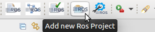
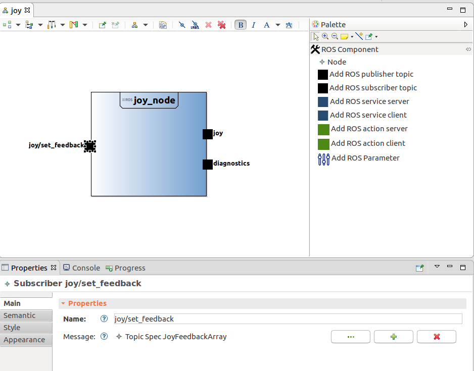
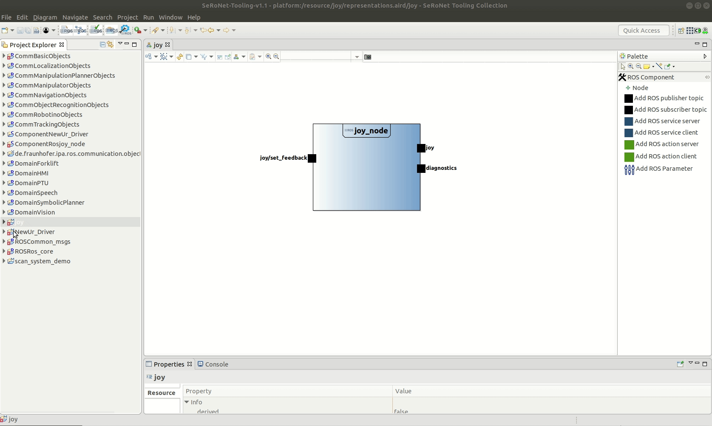
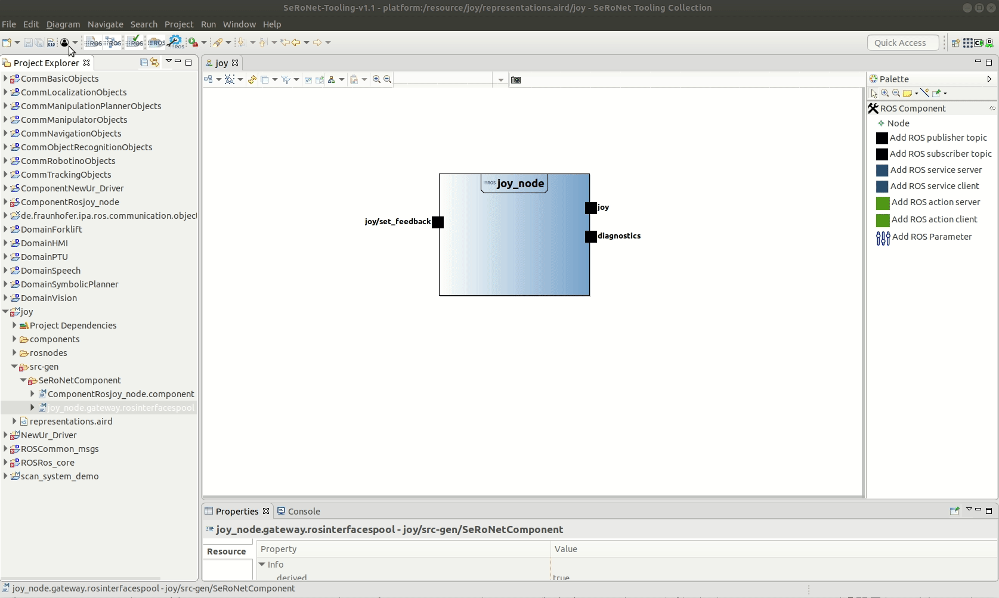
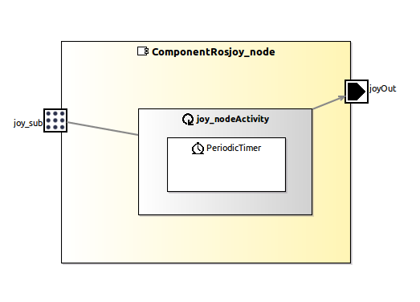
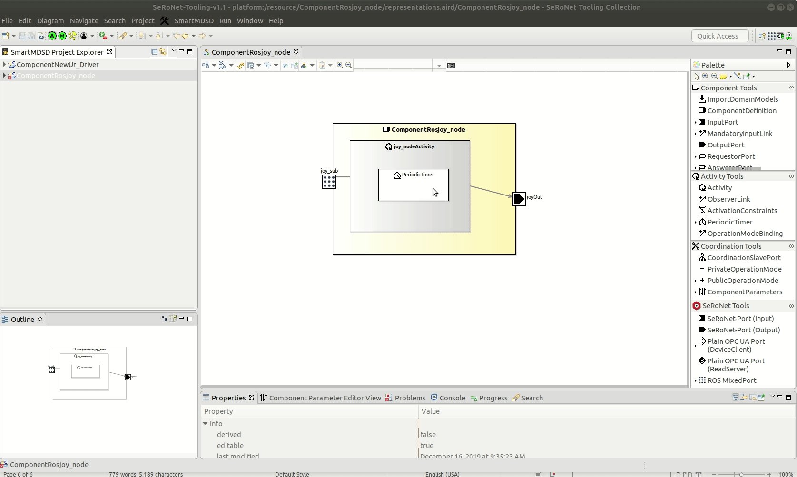
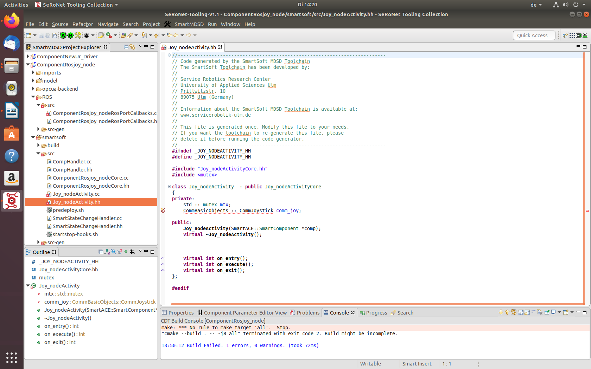
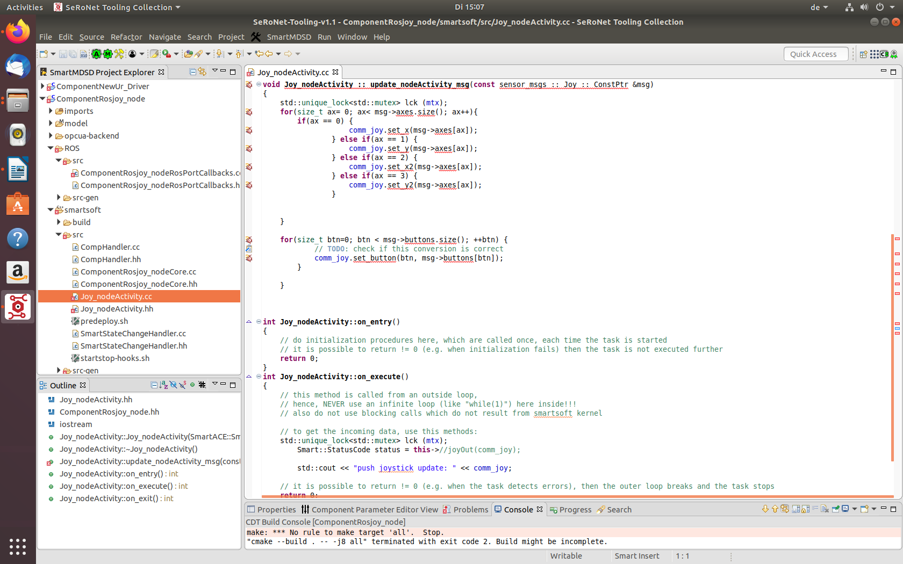
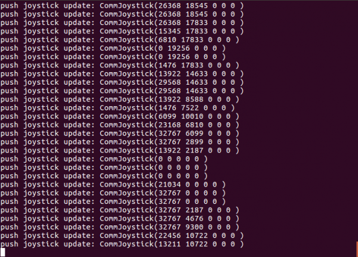

# Ros Mixed Ports - Ros Publisher

This example  shows a practical use case connecting a ROS native package to the SeRoNet world.

For this tutorial we chose one of the most common ROS project: **[joy_node](http://wiki.ros.org/joy)**.

This package requires as dependency the common ROS interfaces, by clicking the button **Import Common ROS Objects** you will get the latest version from GitHub and import them automatically to your workspace, this function button is only available for the ROS developer perspective: menu **Window** => **Perspective** => **Open Perspective** => **ROS developer**.


The first step to connect your ROS package to SeRoNet is encapsulate your node as a ROS model.  We can create a new ROS project by using the button "Add new Ros project"



A dialog window will pop-up asking for a name to the new project, for example: "joy". By clicking "Finish" a new project will be automatically created on your eclipse workspace with a dependency to the ROS common interfaces package and with a model to hold your node description (by default under rosnodes/ProjectName.ros). The wizard should finish with the a representation view  (in case the view was not created by default open the "representation.aird" using the Aird Editor and create a new view in the middle colum under the menu component). The graphical editor is very intuative you can add elements to your model by draging and droping  them from the side toolbar to the center of the screen. Using the bottom properties view you can modify the specifications of each element. For the case of the joy node we have to add the following attributes to our model:

- Node
    - Name: joy_node
- Publisher
    - Name: joy
    - Message (open the icon with 3 dots (•••), navigate to: common_msgs/sensor_msgs/Topic Spec Joy
- Publisher
    - Name: diagnostics
    - Message (open the icon with 3 dots (•••), navigate to: common_msgs/diagnostic_msgs/Topic Spec DiagnosticArray
- Subscriber
    - Name: joy/set_feedback
    - Message (open the icon with 3 dots (•••), navigate to: common_msgs/sensor_msgs/Topic Spec JoyFeedbackArray
    
The resulted model should looks like:



Alternativally, instead of create the model manually, you can just clone an import an existing project that contains the ROS joy package from the following GitHub repository: 

```
git clone https://github.com/ipa-nhg/ros-model-examples
```

To import the project into your system, use the Eclipse menu: **File** => **Import** => **General** => **Existing Projects into Workspace** and click the **Next** button. In the following window, click the **Browse...** button and select your local folder where you cloned the examples repository and choose the project **RosComponents/joy**. Complete the import by clicking the **Finish** button. If you navigate through the **joy** package and open the representation file you can get an overview o the model.


To get further information about how to create the model using the ROS developer tooling please visit the [ROS tooling documentation](https://github.com/ipa320/ros-model#tutorials).


### Auto relay of ROS Mixed Ports

By default the tooling automatically autogenerates the corresponding component interface (a generic model of a component) of all the nodes on your ROS project. The autogenerated components are always located under a new folder called *components/*. This model is the bridge from ROS to other frameworks. For the case of SeRoNet the tooling includes a special function that can be activated by a right-click on the file an choosing the option *Generate ROS-SeRoNet Mixed Port*.


The result of this call is a rospoolinterface file. Complementarily and to make easier the relay of interfaces we incorporated an extra help function that automatically relays one of the ROS interfaces. The previous function through its pop-up dialog guides the user to generates not only the rospoolinterface model but also a suggestion of a SeRoNet component with a ROS mixed Port, for this example we will use the publisher for the topic **joy** . The resulted files will be generated under the folder src-gen/SeRoNetComponent

 


### Import ROS communication objects

This package requires as dependency the common ROS interfaces, available within the **SeRoNet-examples** repository, please clone this repository on the *SMART_PACKAGE_PATH* path folder (by default iti is locate at ~

```
git clone https://github.com/seronet-project/SeRoNet-examples
```

To import the models projects, use the Eclipse menu: **File** => **Import** => **General** => **Existing Projects into Workspace** and click the **Next** button. In the following window, click the **Browse...** button and select your local folder where you cloned the examples repository, choose the path **SeRoNet-Tooling-ROS-Mixed-Port/DomainRosModelsRepositories/** and import all the projects. Complete the import by clicking the **Finish** button.





### Create a SeRoNet component with a ROS mixed Port

These two files can be used to create a new SeRoNet component. First, the perspective have to be changed to the "Component Supplier" one. This perspective will add the option to create a new Component Project by giving a name and a localization and selecting the project **ROSCommon_msgs** and **CommBasicObjects** as dependency. The previously generated SeRoNetComponent files can simply be copied to the model folder of the new project.


For this example the corresponding SeRoNet component with a ROS Mixed Port (by creating a [new SeRoNet component](https://wiki.servicerobotik-ulm.de/tutorials:develop-your-first-component:start) and including the autogenerated files) will shows:



This project requires the **ROS specific domain models**, which are held in the SeRoNet-examples repository.

For further information please check: [Automatic transformation of ROS Components to SeRoNet mixed Ports](https://github.com/seronet-project/SeRoNet-Tooling-ROS-Mixed-Port/tree/master/de.seronet_projekt.ros.componentGateway.generator#automatic-transformation-of-ros-components-to-seronet-mixed-ports)

Before implementing the user logic user must do following  steps in order for project to generate  C++ files.


1. Create Component Project of **joy** and name it **ComponentRosjoy_node**. While creating the project make sure that reference to **CommBasicObjects**. It is a domain model that hold the services for project.
2. While creating ROS mixed port  above a folder src-gen created which contains a **component** and **rosinterfacepool** files. Copy these two files and paste them into newly created component project’s **model** folder.
3. After saving the files to model folder ROS C++ files can be generated as follows.



The generated C++ code can be found newly created subfolder named  **ROS** within project. Open the subfolder and we can see several helper classes generate and implemented the ROS infrstructure.


### Implement user logic of ComponentRosJoy_Node

In this section, we will use the generated ROS C++ infrastructure(see preceding section) to provide additional user logic for our ComponentRosJoy_Node component. This user code mostly about transforming the incoming the  **ROS message** update into a **communication object**, and pushing this object to the ServiceOut **output port**.

Therefore we will refine the initially generated implemenatation of two classes.

**ComponentRosJoy_nodeRosPortCallbacks:** This class can be found under componentRosJoy_node project's subfolder **ROS/src**.

 

The componenRosJoy_nodeRosPortCallbacks class implements the callback function for all ROS subscriber which in this case implements in single function named **joy_sub_cb**. The comment in function suggest that generated method is with an empty implementation.In this example we will propagate **sensor_msgs::joy** to joy_nodeActivity.


**Joy_nodeActivity:** This class can be found under same project's subfolder **smartsoft/src**.

 

In **Joy_nodeActivity** we will extend the generated updated method. This method will be called from **joy_sub_cb** function from  componenRosJoy_nodeRosPortCallbacks class. Moreover an **on_execute** method will transform the **sensor__msgs::joy** into **communication object** and will push this object to **ServiceOut** output port.

User can see the implementation as follows

**ComponentRosJoy_nodeRosPortCallbacks** class implementation.

 


Here in generated **joy_sub_cb** we are handling the calling of method **update_nodeActivity_msg(msg)** that is implemented in **Joy_nodeActivity** class.


**Joy_nodeActivity** class implementation.

 

In **Joy_nodeActivity** class we add a new method **update_nodeActivity_msg** and add a local variable **CommJoystick comm_joy** and this variable will update everytime method **update_nodeActivity** is called.


 


The method **update_nodeActivity_msg** is implemented here in such a way that it transform the **sensor_msgs::joy** ROS message into class member **comm_joy**. In this case we have to protect the member with a mutex as the method on_execute called.
Every time method **on_execute** called it locks the mutex and hand over a local copy to **comm_joy** to generated ServiceOut method which is provided by **Joy_nodeActivityCore** class and which does the actual communication to the output port.

### Compiling the ComponentRosjoy_Node

Currently the **ComponentRosjoy_node** can only be compile from bash terminal. The reason for this restriction is that ROS catkin requires a specific bash setup which cannot beeasily configured within Eclipse CDT plugin.

For compiling the project open new terminal and execute following commands
```
cd (Path to the directory where the project is save). e.g (home/Ros-model/ComponentRosjoy_node)
cd smartsoft
cd build
cmake ..
make
```
We are not directly using the ROS-specific cmake file, instead we are using the top-level component's cmake file which itself include the ROS cmake file and add further configurations. Moreover, cmake assumes the current terminal has been configured for ROS as is described [in the ROS wiki](http://wiki.ros.org/ROS/Tutorials/InstallingandConfiguringROSEnvironment).


### Executing The ROS Joy_Node and ComponentRosjoy_node.

now we will execute the ROS joy_node node and then ComponentRosjoy_node component that willinteract with ROS joy_node.

Before starting software component, it is required pyhsically connect a linux compatible joystick component device to your system. You can check if your joystick device has been recognised in Ubuntu by following command
```
ls /dev/input/js0
```

The device should exist, otherwise the command will fail. For starting the project we need 3 terminal windows.

In the first terminal window start roscore:

```
roscore
```

In a second terminal window execute ROS joy_node (see [ROS Linux Joystick Wiki](http://wiki.ros.org/joy/Tutorials/ConfiguringALinuxJoystick) for further information).
```
rosrun joy joy_node
```

In the last window we will start the **ACE/SmartSoft Naming Service** darmon and the **ComponentRosjoy_node** as Follows:
```
cd $SMART_ROOT_ACE
./startSmartSoftNamingService
./bin/ComponentRosjoy_node
```

This command will execute the the componentRosjoy_node and it will print the respective update values.


