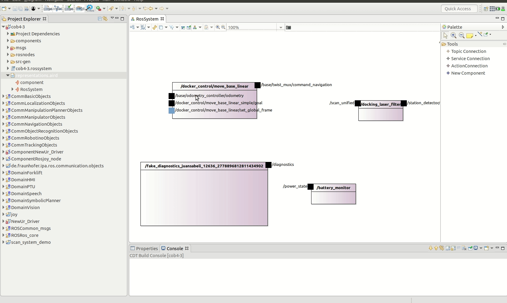
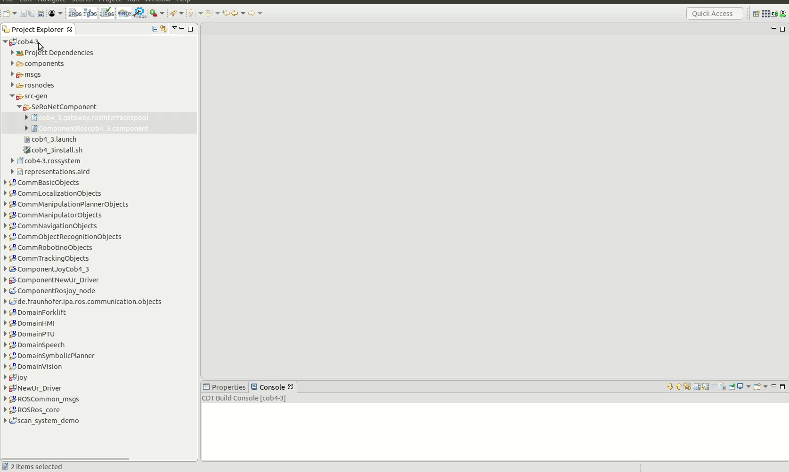
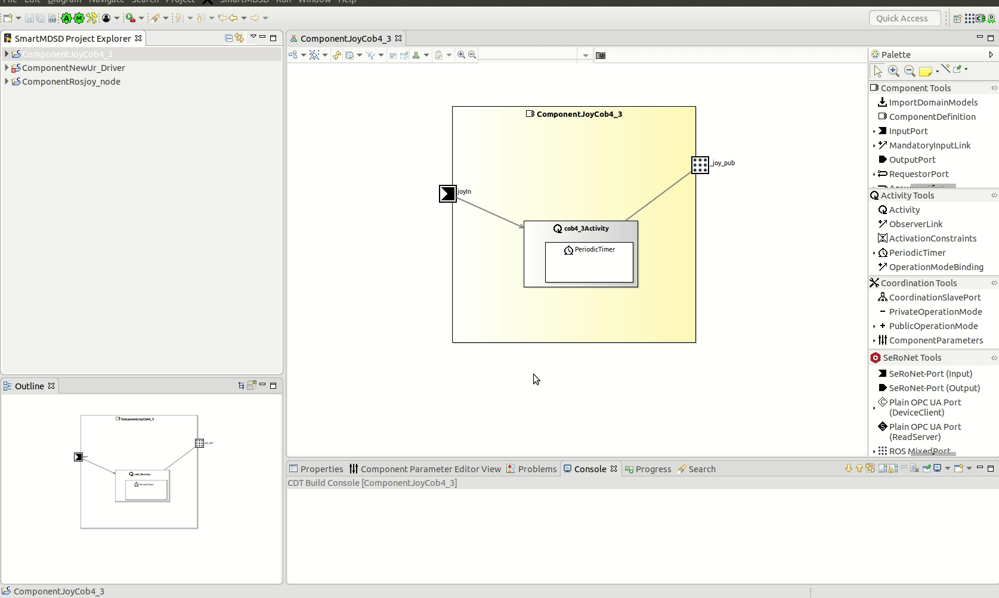
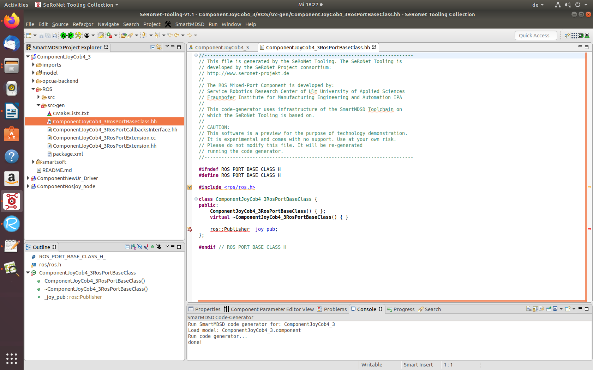
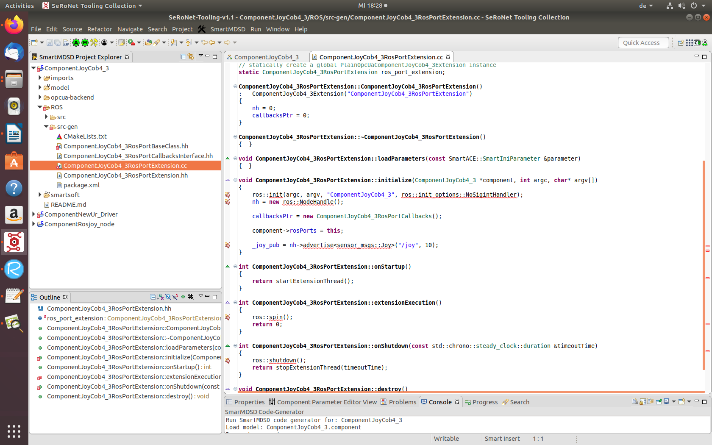
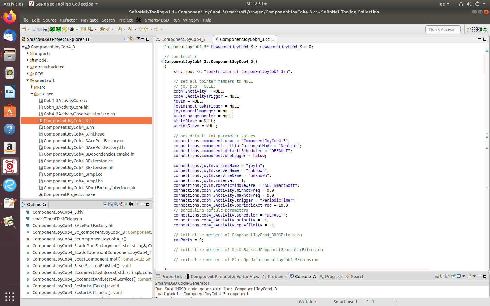
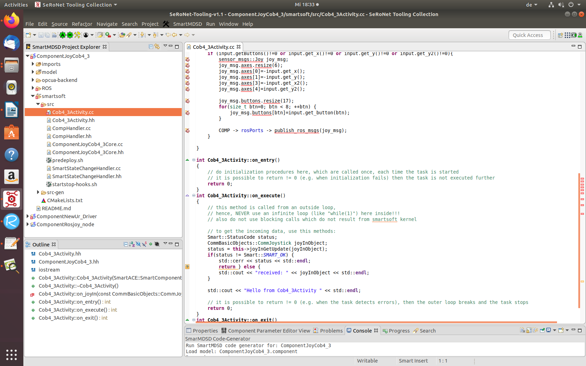
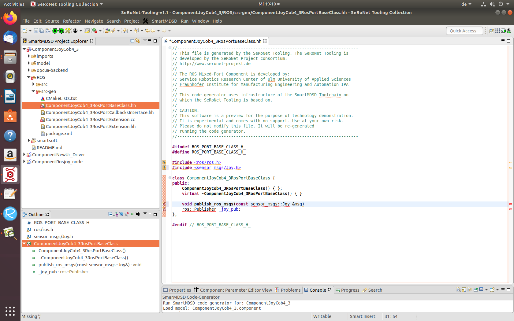
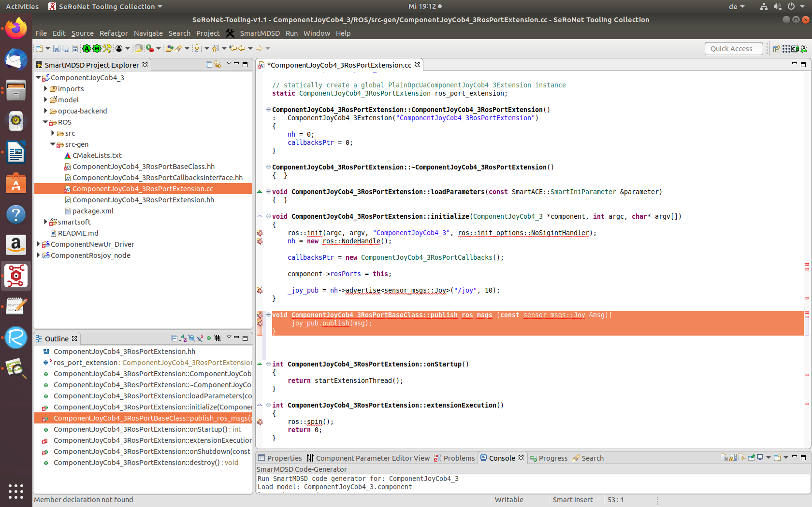
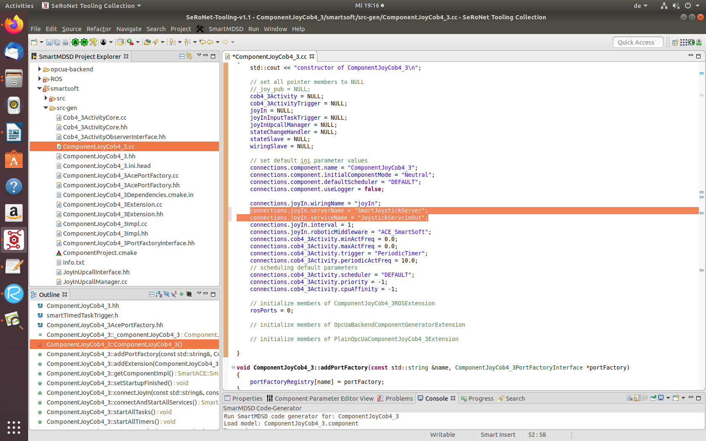

# SeRoNetTooling Collection - Ros Mixed Ports

From ROS deployed system platform to a SeRoNet joystick.

This exmaple shows a practical usecase of ROS subscribing to a SeRoNet publisher
componets. For this exmaple we will use following:

1. **ROS** native platform 
2. **Care-O-bot 3-4**. 
3. Driver of **Joystick** on the SeRoNet side. 
 
This exmaple can be applicable to any ROS native platform that use the standard message **sensor_msgs/Joy** to interact via teleop with its driver module.

###ROS Graph Parser.

First we extract the model of the full system using the runtime model extractor. For further information regarding **ros_graph_parser** see the following link [ros_graph_parser](https://github.com/ipa-led/ros_graph_parser). Run the following command with ROS master on terminal.

```
rosrun ros_graph_parser java_snapshot ros_model_file ros_system_file system_name package_name
```

For better understanding, we will show an example for this tutorial using the simulation of the Care-O-bot 4-3:

```
sudo apt-get install ros-DISTRO-care-o-bot
roslaunch cob_bringup_sim robot.launch robot:=cob4-3 robot_env:=empty
```

Following commands use for monitoring and extract the models:

```
mkdir -p my_workspace/src
cd my_workspace/src
catkin_init_workspace
git clone https://github.com/ipa-led/ros_graph_parser
cd ..
catkin_make
my_workspace/devel/setup.bash
rosrun ros_graph_parser java_snapshot cob4-3.ros cob4-3.rossystem cob4-3 cob4-3
```

The folder **ros_graph_parser/result** will contain the output models. 

###Clone and Import the project.

For this tutorial we choose a ROS project **cob4-3**. First we have to clone a repository.

git clone https://github.com/ipa-nhg/ros-model-examples

After cloning it onto PC, you will find a folder name **RosSystem** in it, which contains the desired project.
To get further information about how to create model using ROS developer tooling please visit [ROS Tooling Documentation](https://github.com/ipa320/ros-model#tutorials) .

To import the project into system, use Eclipse menu : **File => Import => General => Existing Projects into Workspace** and click **Next** button. In following window, click the **Browse** button and select your local folder where you cloned the repository and choose the project **RosSystem/cob4-3**. Complete the import by clicking Finish button.

This package requires as dependency the common ROS interfaces, by clicking the button **Import Common ROS Objects** you will get the latest version from GitHub and import them automatically to your workspace, this function button is only available for the ROS developer perspoective menu : **Window => Perspective => Open Perspective => ROS developer**.

 

If you navigate through cob4-3 package and open representation file, you will get the overview of model.

 


###Create New ROS System.

After importing the project we have to create the **New ROS System**.

 

### Generate ROS-SeRoNet mixed Port.

By default the tooling will automatically autogenerate the corresponding interface(a generic model of a component) of all nodes on your ROS project. The autogenerated components are always located under new folder called **components**. This model is the bridge from ROS to other frameworks. For the case of SeRONet the tooling includes a special function that can be activated by right-click on the file and choosing the option **Generate ROS-SeRONet Mixed Port**.

 

###Create a new Component.

For creating new Component we have to do the following steps:

1. Change to the **Component perspective**.
2. Create a new component: name: **ComponentJoyCob4_3** and import dependencies: **CommBasicObjects** and **ROSCommon_msgs**.

 

###Generate Code Automatically
1. copy the files under **cob4-3/src-gen/SeRoNetComponent (rosintefacespool and ComponentJoyCob4-3)**.

 

2. **Generate** code.




###Compilation of ComponentJoyCob4_3

Currently the **ComponentJoyCob4_3** can only be compile from bash terminal. The reason for this restriction is that ROS catkin requires a specific bash setup which cannot beeasily configured within Eclipse CDT plugin.

For compiling the project open new terminal and execute following commands
~~~~
cd (Path to the directory where the project is save). 
cd smartsoft
mkdir build
cd build
cmake ..
make
~~~~

###Implement user logic of ComponentJoyCob4_3

In this section, we will use the generated ROS C++ infrastructure(see preceding section) to provide additional user logic for our ComponentRosJoyStick component. This user code mostly about transforming the incoming the  ROS message update into a communication object, and pushing this object to the ServiceOut output port.

Therefore we will refine the initially generated implemenatation of four classes.

**ComponentJoyCob4_3RosPortBaseClass.hh**. It can be found under **ROS/src-gen** folder.

 

**ComponentJoyCob4_3RosPortExtension.cc**. It can be found under **ROS/src-gen** folder.

 

**ComponentJoyCob4_3.cc**. It can be found under **smartsoft/src-gen** folder.

 

**Cob4_3Activity.cc**. It can be found under **smartsoft/src** folder.

 

You can see the implementation as follows:

**ComponentJoyCob4_3RosPortBaseClass.hh**

 

**ComponentJoyCob4_3RosPortExtension.cc**

 

**ComponentJoyCob4_3.cc**

 

**Cob4_3Activity.cc**

 

After making the modification to above classes compile the project again using the commands you used before:

~~~~
cd (Path to the directory where the project is save). 
cd smartsoft/build
make
~~~~


###Executing the Component ComponentJoyCob4_3.

now we will execute the ComponentJoyCob4_3 component.

Before starting software component, it is required pyhsically connect a linux compatible joystick component device to your system. 

Use following command to connect the Joystick to system.
~~~~
cd ~/SOFTWARE/smartsoft./bin
./SmartJoystickServer
cd ~/SOFTWARE/smartsoft./bin
./ComponentJoyCob4_3
~~~~
You can check if your joystick device has been recognised in Ubuntu by following command.
~~~~
ls /dev/input/js0
~~~~
The device should exist, otherwise the command will fail. For starting the project we need 2 terminal windows.

In the **First terminal window execute roscore**.
~~~~
roscore
roslaunch cob_bringup_sim robot.launch robot:=cob4-3 robot_env:=empty
~~~~
 In the **second terminal window go to ~/SOFTWARE/smartsoft**
~~~~
cd ~/SOFTWARE/smartsoft
./startSmartSoftNamingService
~~~~

This command will execute the the componentRosjoy_node and it will print the respective update values.
