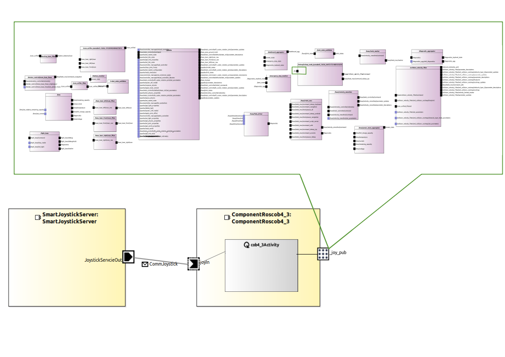
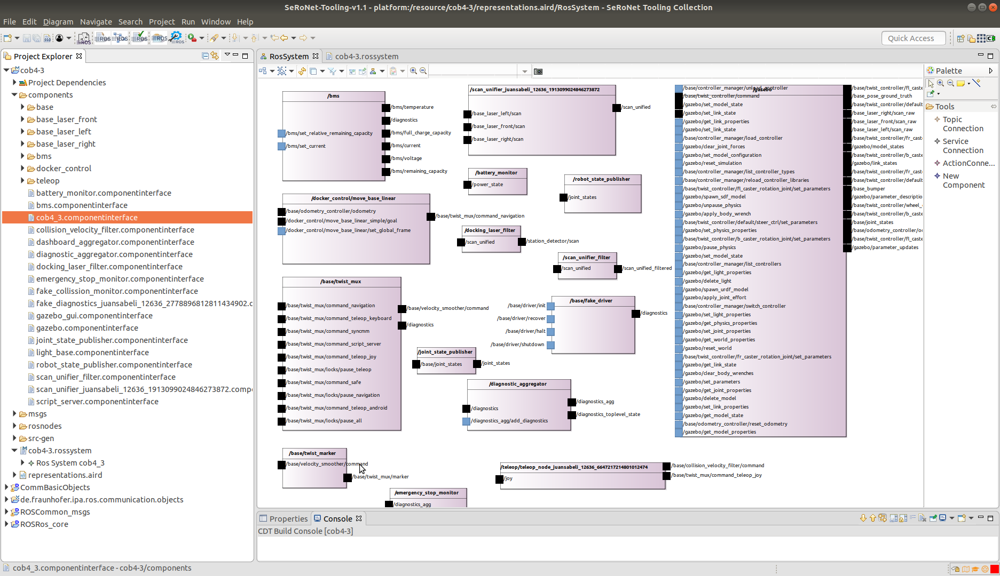
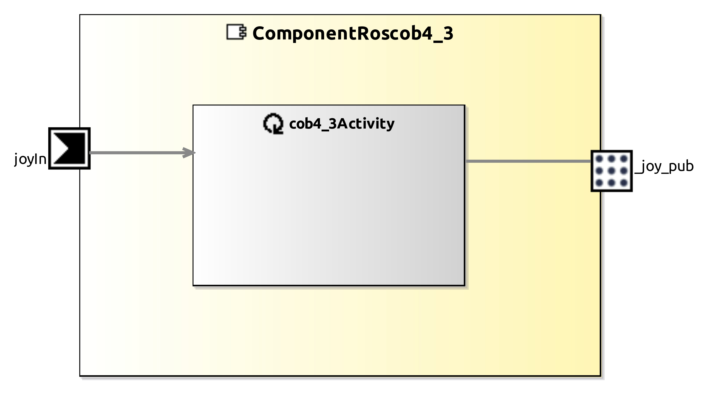
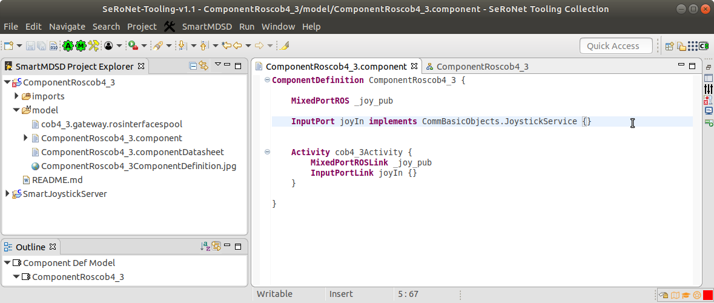
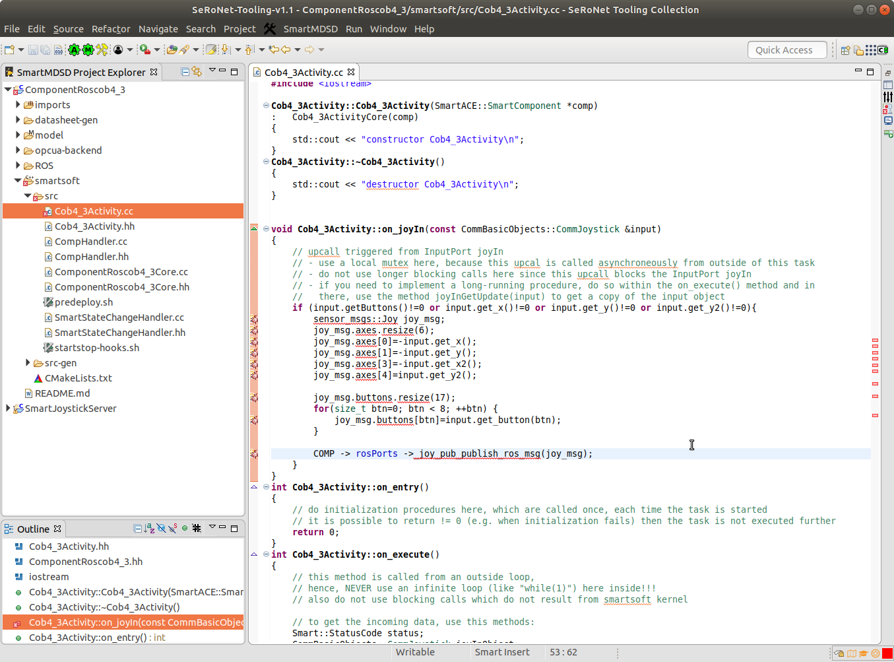
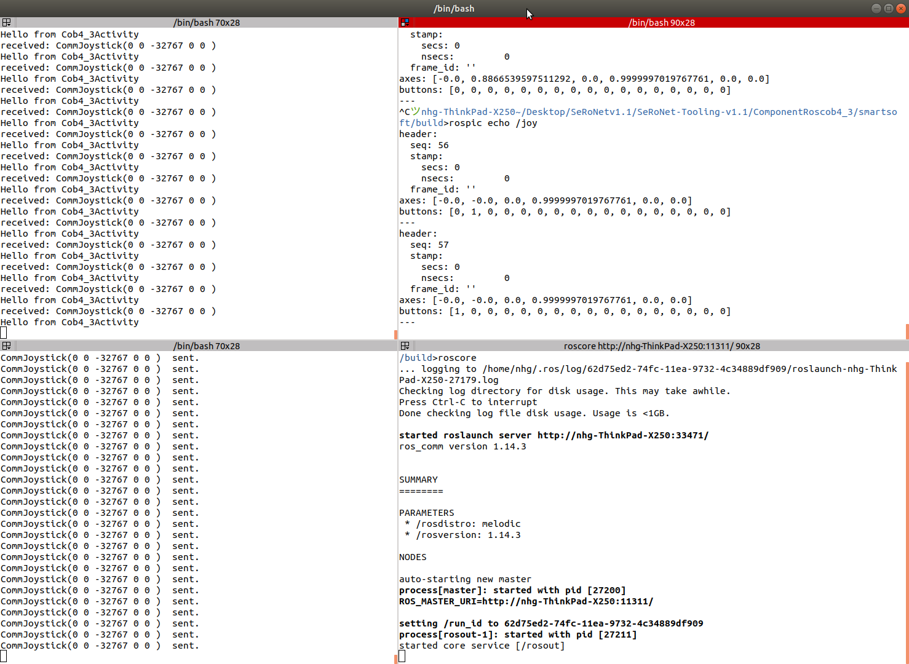

# ROS Subscriber relay to SeRoNet network

This tutorial shows how to use the [SeRoNet Mixed port features](https://github.com/seronet-project/SeRoNet-Tooling-ROS-Mixed-Port) to connect a **ROS node model** from the [SeRoNet ROS tooling collection](https://github.com/ipa320/ros-model/) to the SeRoNet network. For this case, we use a **ROS subscriber** as interface to be relayed and explain the resulted model, the C++ code that will be auto generated and point the code parts where the user can implement further functionalities.

Some of the concepts explained in [SeRoNet Tooling Collection - ROS support](../../README.md) are required to perform this tutorial. A previous default setup of the workspace is necessary to follow the instructions of the tutorial: [WORKSPACE SETUP](../ROSMixedPortTutorials_WSsetup.md).

### System overview



### Required packages

**Domain Models projects::**

- [CommBasicObjects](https://github.com/Servicerobotics-Ulm/DomainModelsRepositories/tree/master/CommBasicObjects)

- [ROSRos_core](../../DomainRosModelsRepositories/ROSRos_core)

- [ROSCommon_msgs](../../DomainRosModelsRepositories/ROSCommon_msgs)

**ROS projects:**

- [de.fraunhofer.ipa.ros.communication.objects](https://github.com/ipa320/RosCommonObjects/tree/master/de.fraunhofer.ipa.ros.communication.objects)

- [cob4-3](cob4-3)

**Component model projects:**

- [SmartJoystickServer](https://github.com/Servicerobotics-Ulm/ComponentRepository/tree/master/SmartJoystickServer)

- ComponentJoyCob4_3 (it will be created in this tutorial)

### ROS components

For this example we selected a native ROS base platform concretely a [Care-O-bot 4](http://wiki.ros.org/Robots/cob4). However, **the component outcome of this tutorial is valid for any ROS base platform** which cartesian velocity can be commanded from a joystick (i.e. the teleop node subscribes to a /joy[sensor_smsg/Joy] topic), and this will work independently of the use as reference the cob4-3 ROS project for these modeling steps and start your own robot during the [execution test](#execution).

For this experiment we decided to use the version 3 of the Care-O-bot 4 family. To easily extract the model of this complex robot system and having already available the source code and a very realistic simulation environment, we used the [ros_graph_parser](https://github.com/ipa-led/ros_graph_parser) to get automatically the complete model.

To apply this to other deployed robot, you have to run together (within the same ROS master) the ROS system to be analyzed and the *ros_graph_parser* node using the following command line:

```
rosrun ros_graph_parser java_snapshot MyRobot.ros MyRobot.rosystem MyRobotName MyRobotName
```
After its execution the folder **ros_graph_parser/result** will contain the output models ( MyRobot.ros and MyRobot.rosystem). Remember that the ROS tooling required also the reference to the communication object types (msgs, srvs and actions). Which packages have to be also generated, please review the [main documentation](../../SeRoNet-Tooling-ROS-Mixed-Port#step-1-use-the-ros-developer-perspective-to-describe-ros-nodes) about how to obtain the required models dependencies.

The ROS tooling project associated to this ROS system  is delivered within this repository, you can import it using the Eclipse menu: **File** => **Import** => **General** => **Existing Projects into Workspace** and click the **Next** button. In the following window, click the **Browse...** button and select your local folder where you cloned the examples repository and choose the project **SeRoNet-examples/SeRoNet-Tooling-ROS-Mixed-Port/ROS-MixedPort-Examples/ROSSubscriber_examples/cob4-3**. Complete the import by clicking the **Finish** button. If you navigate through the **cob4-3** package and open the [representation file](https://www.eclipse.org/sirius/doc/user/general/Aird_Editor.html) you can get an overview o the model.


To get further information about how to create the model using the ROS developer tooling please visit the [ROS tooling documentation](https://github.com/ipa320/ros-model#tutorials).

### SeRoNet components

By default the tooling automatically auto generates the corresponding component interface (a generic model of a component) of all the nodes and  systems on your ROS project. The auto generated components are always located under a new folder called *components/*. 



This *ComponentInterface* model is the bridge from ROS to other frameworks. For the case of SeRoNet the tooling includes a special function that can be activated by a right-click on the file an choosing the option *Generate ROS-SeRoNet Mixed Port*, for this example we will use the *cob4-3.componentinterface* file as input. The result of this call is a *rospoolinterface* file. Complementarity and to make easier the relay of interfaces we incorporated an extra help function that automatically relays one of the ROS interfaces. The previous function through its pop-up dialog guides the user to generates not only the *rospoolinterface* model but also a suggestion of a SeRoNet component with a ROS mixed Port, for this example we will use the **Subscriber** for the topic **joy** . The resulted files will be generated under the folder *src-gen/SeRoNetComponent*.


These two files can be used to create a new SeRoNet component. First, the perspective have to be changed to the *Component Supplier* one. This perspective will add the option to [create a new Component Project](https://wiki.servicerobotik-ulm.de/tutorials:develop-your-first-component:start). Using the help dialog menu you can give the following description to your new component project:

- Project name: **ComponentRoscob4_3** (it is very important that the name of the project is the same than the name of the component, by default the ROS->SeRoNet converter set as component name **ComponentRos**MyRosNodeName )
- Model type: **ComponentDefinition** and **ComponentDatasheet**
- Dependencies: **ROSCommon_msgs** and **CommBasicObjects**


Once the *Component Project* is created switch again to the ROS developer perspective and move the two previously auto-generated files: *cob4-3/src-gen/SeRoNetComponent/ComponentRoscob4_3.component* and *cob4-3/src-gen/SeRoNetComponent/cob4_3.gateway.rosinterfacespool* to the folder:  *ComponentRosjoy_node/model*.

The next figure shows the resulted SeRoNet component:



For this tutorial we have to make a minor modification of the auto-created model we will use a SeRoNet plain communication object that already exists for the Joystick. You can open  the file *ComponentRoscob4_3/model/ComponentRoscob4_3.component* and modify the implementation of the input port to get the object: **CommBasicObjects.JoystickService**:



The other SeRoNet component that we will use for this example is the [SmartJoystickServer](https://github.com/Servicerobotics-Ulm/ComponentRepository/tree/master/SmartJoystickServer) . The [SeRoNet workspace setup](../ROSMixedPortTutorials_WSsetup.md) should install this component automatically under the path *$SMART_PACKAGE_PATH/ComponentRepository* , you can import it to your workspace  (**File** => **Import** => **General** => **Existing Projects into Workspace** and click the **Next** button. In the following window, click the **Browse...** button and select your local folder **~/SOFTWARE/smartsoft/repos/ComponentRepository/SmartJoystickServer**) and build it on your system using the *Build Project* button .

### Code implementation

In this section, we will adapt the auto generated C++ code to transform the incoming SeRoNet  communication object update from a *joyIn*  into a ROS message (sensor_msgs/Joy) and push this object to the ROS topic */joy*.

In case the *AutoCodeGeneration*  button is disabled, you can select your project from the project Explorer  and press the *RunCodeGeneration*   , these two buttons are only available for the *Component Supplier* perspective.

The code generator will create 3 folders to hold the C++ code implementation of your component:

- ROS : this is the code related to the ROS Mixed Port. For this concrete case, it holds the implementation of the ROS Publisher (*_joy_pub* Port) to the */joy* topic.
- smartsoft: this folder contains the code associated to the SeRoNet plain port and body of the component. For this example, it holds the implementation of the Push Port *joyIn* and the activity *cob4_3Activity*
- opcua-backend: this is the code related to the OPC UA backend for the SeRoNet plain port. For this concrete example this code is not relevant.

For the ROS Mixed components the code generator is designed to completely implement the ports and prepare the Activity classes to be completed manually. This approach reduces considerably the integration effort for the user, who can concentrate on a particular area of the code to implement the logic of the component, consistently with the implementation of [SeRoNet plain components](../../../SeRoNet-Tooling-Hello-World/#creating-two-new-example-components).

That means that the user should be mostly interested on the code related  to the activity, which can be found under *smartsoft/src*. There you we can find for this example the activity source file (*smartsoft/src/Cob4_3Activity.cc*).

The source code of the *Cob4_3Activity.*  (*smartsoft/src/Cob4_3Activity.cc*) contains the method *on_joyIn* which getting as input the current message from the SeRoNet middleware (type *CommBasicObjects::CommJoystick*) transform it to a ROS type (sensor_msgs/Joy)  and send the data to ROS through the ROS publisher *joy* (implemented in the *ComponentRoscob4_3RosPortBaseClass* class; code -> *ROS/src-gen/ComponentRoscob4_3RosPortBaseClass.hh* ):



--> [Solution code](ComponentRoscob4_3) :wink:

### Execution

This section requires a proper installation of the SeRoNet backend and the correct setup  of the workspaces (see [SeRoNet workspace setup](../ROSMixedPortTutorials_WSsetup.md))

The first step, before we execute the code, is build the software. Unfortunately, the ROS build environment is not well supported by Eclipse which means that for the ROS Mixed Port examples the code have to be compiled using a terminal. 

```
source /opt/ros/*DISTRO*/setup.bash
cd *YourWSPath*/ComponentRoscob4_3
cd smartsoft
mkdir build
cd build
cmake ..
make
```

The previous commands have to create a SeRoNet executable file for the ComponentRoscob4_3 under the folder *$SMART_ROOT_ACE/bin*, which execution will create a ROS publisher to the  */joy* topic and relay the command got by the SeRoNet *SmartJoystickServer* device

Before starting the software, it is required connect physically a Linux compatible joystick component device to your system. You can check if your joystick device has been recognized using the following command:
```
ls /dev/input/js0
```

Then , as usual, open a new terminal window and start the ROS master:

```
roscore
```

In a second terminal window execute your robot simulation for example the Care-O-bot one: 
```
roslaunch cob_bringup_sim robot.launch robot:=cob4-3 robot_env:=empty
```

Alternatively to test quickly the tutorial you can simply subscribe to the */joy* topic:

```
rostopic echo /joy
```

To configure the connection, ACE at startup searches for an according configuration file for every component within a local folder named etc. For instance, for the SmartJoystickServer component, an ini-file named *SmartJoystickServer.ini* can be created within the folder *$SMART_ROOT_ACE/etc*:

```
mkdir $SMART_ROOT_ACE/etc
cp $SMART_PACKAGE_PATH/SeRoNet-examples/SeRoNet-Tooling-ROS-Mixed-Port/ROS-MixedPort-Examples/ROSSubscriber_examples/*.ini $SMART_ROOT_ACE/etc/.
```

And lastly, in a two new terminal we have to start the *ACE Naming Service* daemon to allow the communication or the ACE side, the *SmartJoystickServer* device and our created *ComponentRoscob4_3* as follows:

```
cd $SMART_ROOT_ACE
./startSmartSoftNamingService
./bin/SmartJoystickServer
./bin/ComponentRoscob4_3
```



